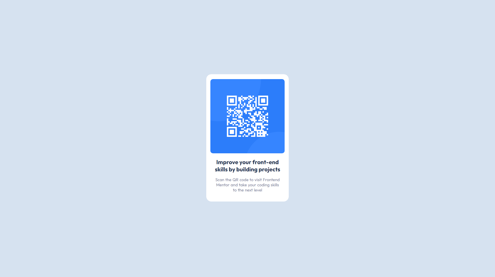

# Frontend Mentor - QR code component solution
[Inglês 🇬🇧](README.md)/[Português 🇧🇷](README.pt-br.md)

Esta é uma solução para o [desafio do componente QR code na Frontend Mentor](https://www.frontendmentor.io/challenges/qr-code-component-iux_sIO_H). Os desafios da Frontend Mentor ajudam você a melhorar suas habilidades de codificação criando projetos realistas.

## Índice

- [Visão geral](#visão-geral)
  - [Captura de tela](#captura-de-tela)
  - [Links](#links)
  - [Desenvolvido com](#desenvolvido-com)
- [Autor](#autor)

## Visão geral

Componente QR Code simples feito para o Desafio Frontend Mentor

### Captura de tela

### Links

- URL da solução: [Repositório da solução](https://github.com/KennedyBarreto/qr-code-component)
- URL do site ao vivo: [Site ao vivo](https://kennedybarreto.github.io/qr-code-component/)

### Desenvolvido com

- HTML5
- CSS

## Autor

- [Github](https://github.com/KennedyBarreto)
- [LinkedIn](https://www.linkedin.com/in/kennedy-barreto/)
- [Twitter](https://twitter.com/isnt_kennedy)
